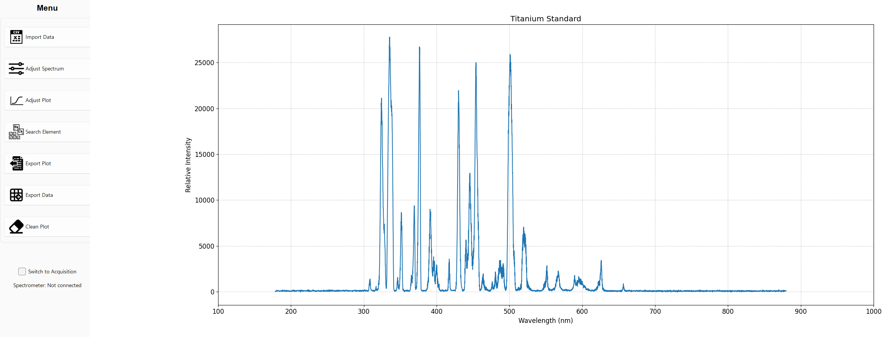
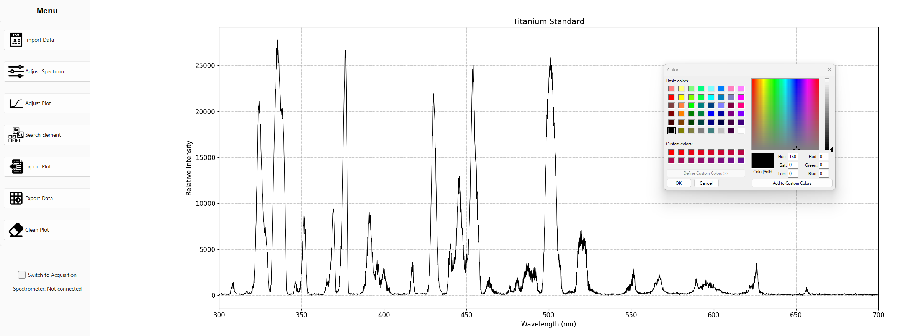
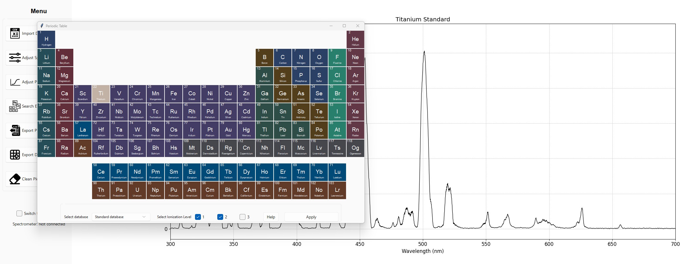
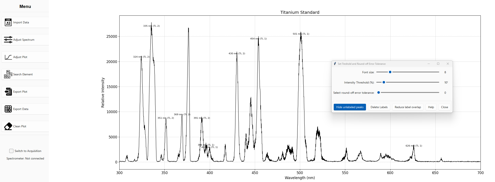

# LIBS-Data-Analysis

A standalone Windows application for Laser Induced Breakdown Spectroscopy (LIBS) data analysis. This tool allows users to import, adjust, and analyze LIBS data, offering functionalities such as spectrum adjustment, plotting, and elemental line identification using a built-in periodic table.

## Features

- **Import Data**: Easily load your LIBS data for analysis.
- **Adjust Spectrum**: Normalize your data and apply various smoothing methods:
  - **Moving Average**
  - **Gaussian Filter**
  - **Savitzky-Golay Filter**
  - **Median Filter**
  - **Wavelet Transform**
- **Adjust Plot**: Customize plot appearance, including axis adjustments and line aesthetics.
- **Export**: Save your adjusted plots and data for further use or reporting.
- **Search Element**: A comprehensive module that provides a periodic table interface. Select elements, specify database sources, ionization levels, labeling preferences, and set thresholds for line identification.
- **Calibration-Free Module** (In Development): Aims to offer quantitative/calibration-free LIBS analysis. Note: This module requires a spectrometer with high resolution.
- **Acquisition Function** (In Development): Integration with the Ocean Optic spectrometer for simultaneous data acquisition and analysis.

## Installation

### Compiled Software

The software is provided as a standalone executable for Windows. No installation or prerequisites are required.

**[📥 Download the latest version here](https://github.com/aleponce4/LIBS-Data-Analysis/releases/latest)**

*Always get the latest version with bug fixes and new features from our GitHub releases.*

### From Source

1. **Clone the repository**.
2. **Install the required libraries**:
   ```
   pip install -r requirements.txt
   ```
3. **Run the application**:
   ```
   python main.py
   ```

## Usage

1. **Run the Software**: Simply double-click the downloaded executable to start or run `main.py` if using the source code.
2. **Import Data**: Use the 'Import Data' function to load your LIBS data.

3. **Adjust and Analyze**: 

   - **3.1 Visual Apearance**: Use the 'Adjust Plot' tab to change the plot's visual apearance
   
   - **3.2 Normalization**: Use the 'Adjust Spectrum' tab to apply apply normalization fitlers
   - **3.3 Peak Search**:  Use the 'Search Element' tab to search desired peaks. Select elements of interes by cliking in the periodic table, and select wanted ionization levels and peak database.
   
   - **3.4 Final adjustments**:  Use the next tab to define an intensity treshold for peaks of itnerest and hide unlabel peaks.
   

4. **Export Results**: Once satisfied, you can export your plots and adjusted data.

## Contributing

This project is currently in active development. If you have suggestions, feedback, or would like to contribute, please [contact the author](https://github.com/aleponce4)

## Acknowledgments

I'd like to extend my gratitude to:

- **Onteko Inc.** for providing the resources that made the development of this software possible.
- **Teresa Flores, Phd** for her invaluable spectroscopy expertise, guidance throughout the project, and for conducting the essential experimentation that led to the development of the elemental databases.
