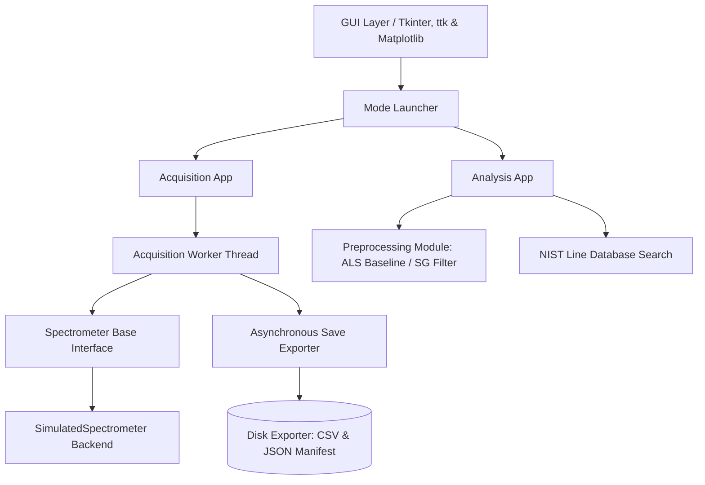

# LIBS Spectroscopy Workbench

[](https://github.com/aleponce4/libs-spectroscopy-workbench/actions/workflows/ci.yml)
[](https://www.gnu.org/licenses/gpl-3.0)
[](https://www.python.org)

## Overview

The LIBS Spectroscopy Workbench is a scientific software platform for Laser-Induced Breakdown Spectroscopy (LIBS) data processing, spectral visualization, elemental line identification, and 2D spatial mapping.

> **Product Scope & Relationship**  
> This repository is the public edition of a larger private product (`ProLIBSpector`), which adds support for physical instrument hardware. This public edition provides the generic interfaces, simulated hardware engines, spectral analysis algorithms, interactive visualization, and selected nonconfidential acquisition workflows. Commercial classification models and physical driver binaries are maintained separately.
>
> **Not in this edition**, and reported as such in the UI rather than failing silently: vendor spectrometer drivers, the laser-stage driver, automated laser-stage runs, automated 2D mapping *acquisition*, unattended multi-plate acquisition across a plate holder, and the trained spectra-readiness calibration. Analysing existing 2D mapping runs is fully supported here; only acquiring them requires the private edition. Modules standing in for these features carry a `PUBLIC-EDITION STUB` header stating what the private version does.
>
> The Python package is still importable as `prolibspector`, so existing code and saved settings keep working.

---

## Supported Public Features

- **Hardware Simulation Engine**: `SimulatedSpectrometer` engine mimicking physical nanosecond plasma emission decay, dark counts, exposure integration timing, shot noise, and trigger delay responses.
- **High-Throughput Plate Workflow**: Plate autosave for 6/12/24/48/96/384-well formats with configurable shots-per-well and row- or column-major ordering, a live well-status plate map, per-shot discard, specific-well repair passes, atomic run-state persistence, and resume of an interrupted plate (from saved state or by scanning the folder).
- **Spectra Readiness QC**: Deterministic per-shot gating on detector saturation, signal-to-noise, and flat-trace detection, with a per-shot CSV and one-click requeueing of non-passing wells.
- **Spectral Preprocessing Engine**: Savitzky-Golay and Gaussian smoothing, Asymmetric Least Squares (ALS) baseline correction, and three normalizations - min-max, total-intensity (area), and Standard Normal Variate (SNV).
- **NIST Line Database Search**: Internal reference database derived from NIST Atomic Spectra Database (ASD) data covering neutral and ionic species (I, II, III).
- **Interactive Visualization**: High-DPI Tkinter/ttk and Matplotlib spectrum canvas with axis and wavelength-range controls, automated peak detection, and NIST line annotation with overlap reduction.
- **Reliable Asynchronous Persistence**: Bounded background save queue with ordered single-writer persistence, backpressure, failure propagation, and drain-before-finalization behavior.
- **Spatially Resolved 2D Mapping**: Grid spectrum visualization, multi-element evidence fusion, and peak intensity heatmap rendering.

---

## Technical Overview & Screenshots

### 1. Main Application Interface (Analysis Mode)


*Main application interface in Analysis Mode displaying an imported reference Titanium spectrum (200-880 nm) with interactive curve controls, spectrum parameter sidebar, and plot navigation tools.*

---

### 2. Peak Identification & NIST Database Search


*Automated peak detection and NIST elemental line matching for Ti I and Ti II emission lines (e.g. 335 nm, 454 nm, 501 nm), with sliders for label font size, intensity threshold, prominence filtering, and database matching tolerance.*

---

### 3. Spatially Resolved 2D LIBS Mapping Demonstration (Decorated Ceramic Tile)


*Spatially resolved 2D LIBS elemental mapping composite of a decorated ceramic tile sample. Panels display the original sample photograph alongside corresponding spatial regions for blue pigments (Copper Cu, Cobalt Co), overglaze dark outline ink (Manganese Mn, Lead Pb), and non-present control (Cesium Cs).*

*Illustrative figure. It was produced from a measurement run on the private edition's hardware; the source spectra and the script that rendered the composite are not part of this repository, so the colorbar values are not reproducible from what is published here.*

> For additional figures (Periodic Table selector, annotated spectra), file format specifications, and caching internals, see the [Technical Gallery & Architecture Guide](docs/gallery.md).

---

## Architecture Overview


```mermaid
flowchart TD
    UI[GUI Layer / Tkinter, ttk & Matplotlib] --> Launcher[Mode Launcher]
    Launcher --> Analysis[Analysis App]
    Launcher --> Acquisition[Acquisition App]
    
    Acquisition --> Worker[Acquisition Worker Thread]
    Worker --> DevBase[Spectrometer Base Interface]
    DevBase --> SimDev[SimulatedSpectrometer Backend]
    
    Worker --> Writer[Asynchronous Save Exporter]
    Writer --> Storage[(Disk Exporter: CSV & JSON Manifest)]
    
    Analysis --> Preproc[Preprocessing Module: ALS Baseline / SG Filter]
    Analysis --> NIST[NIST Line Database Search]
```

---

## Quick Start (Simulated Mode)

### Prerequisites

Python 3.10+ is required.

### Installation

```bash
git clone https://github.com/aleponce4/libs-spectroscopy-workbench.git
cd libs-spectroscopy-workbench
pip install -e .
```

Two optional features have optional dependencies: wavelet denoising needs
`PyWavelets`, and Parquet map exports need `pyarrow`. Install both with:

```bash
pip install -e ".[full]"
```

The editable install (`-e`) is required, not a convenience. The bundled assets
(`Icons/`, `Help/`, `element_database.csv`, `persistent_lines.csv`,
`calibration_data_library.csv`) live at the repository root alongside `src/`
rather than inside the package, and the application resolves them relative to
that root. A plain `pip install .` will import but will not find its icons or
spectral databases, so run the application from a checkout.

### Running the Application

Launch the desktop interface using the simulated backend:

```bash
python main.py
```

Select **Simulated Acquisition** to test live spectral collection without physical hardware, or **Analysis Mode** to process offline spectra and compare NIST elemental lines.

---

## Testing & Validation Scope

Automated unit and integration tests verify device initialization, wavelength generation, baseline correction algorithms, background save writer reliability, plate autosave and resume behavior, spectra readiness gating, and 2D spatial mapping output contracts.

`tests/test_imports.py` imports every module under `src/prolibspector` and fails on any `ImportError`. CI runs it as its own step before the rest of the suite, so a missing module or dependency can never again pass CI while the application is unable to start.

To execute the test suite locally:

```bash
pytest
```

---

## Elemental Line Database & NIST Citation

Elemental line search and peak matching rely on an internal reference table derived from NIST ASD data.

> Kramida, A., Ralchenko, Y., Reader, J., and NIST ASD Team. *NIST Atomic Spectra Database* (Version 5.12). National Institute of Standards and Technology, Gaithersburg, MD. DOI: [10.18434/T4W30F](https://doi.org/10.18434/T4W30F).

---

## License

This public edition is released under the [GNU General Public License v3.0](LICENSE).

