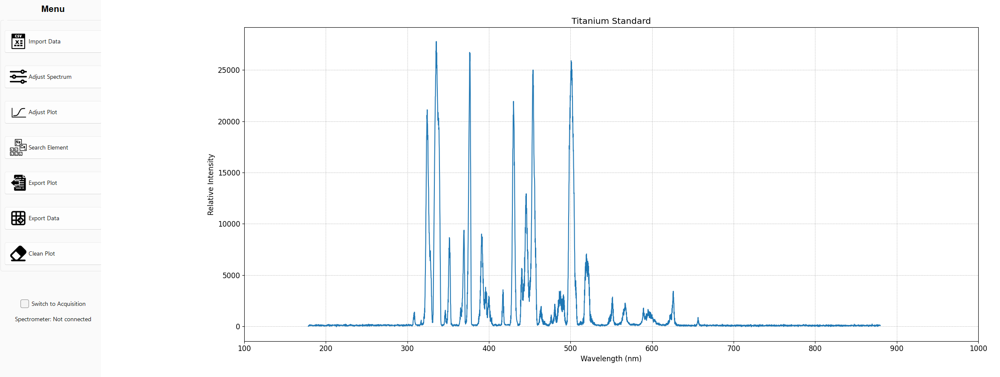
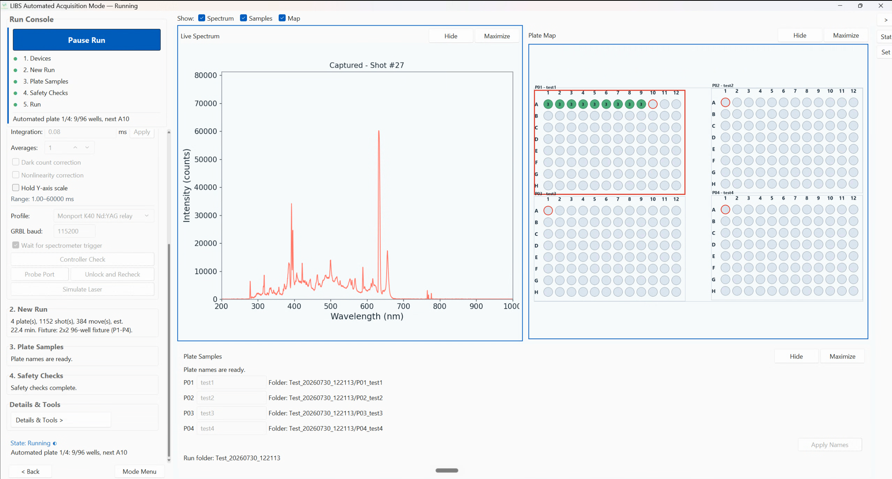
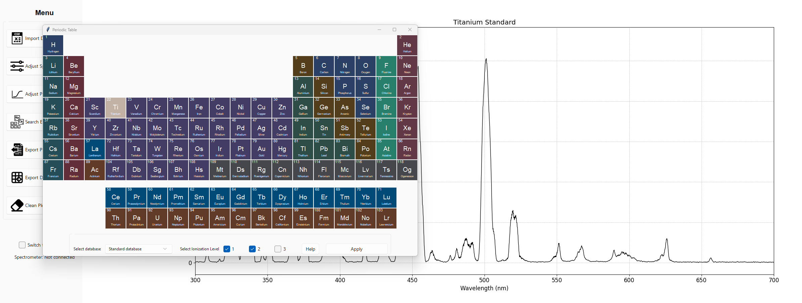
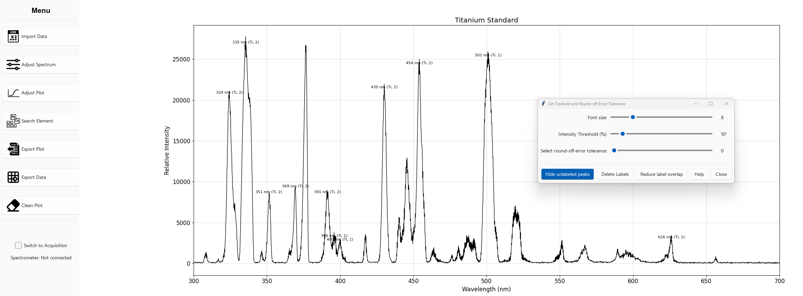
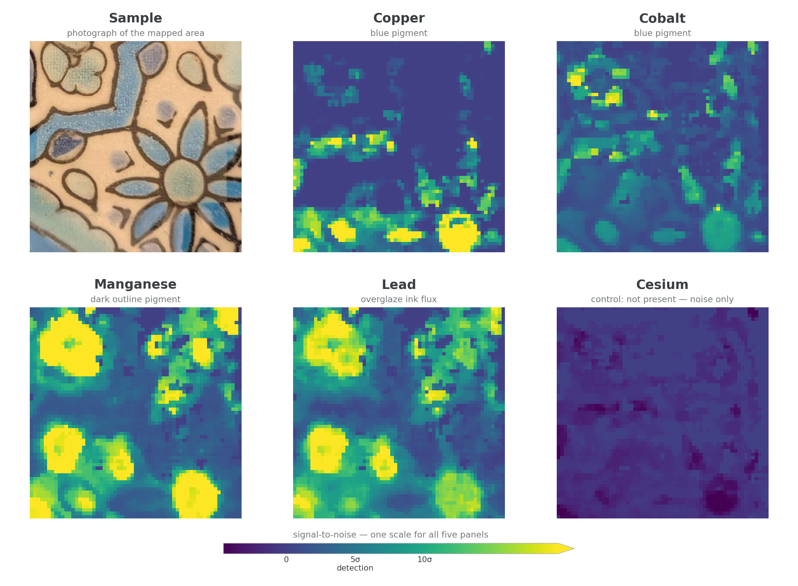
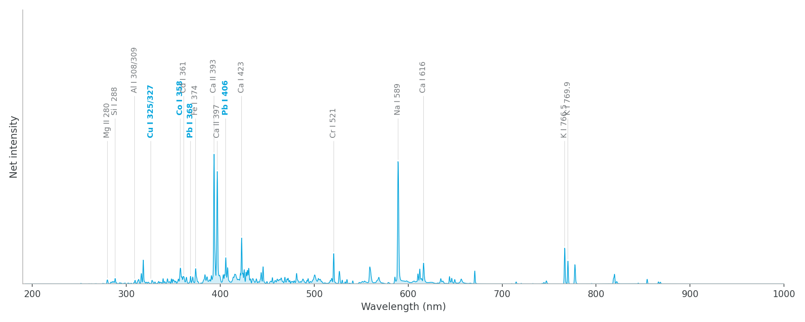
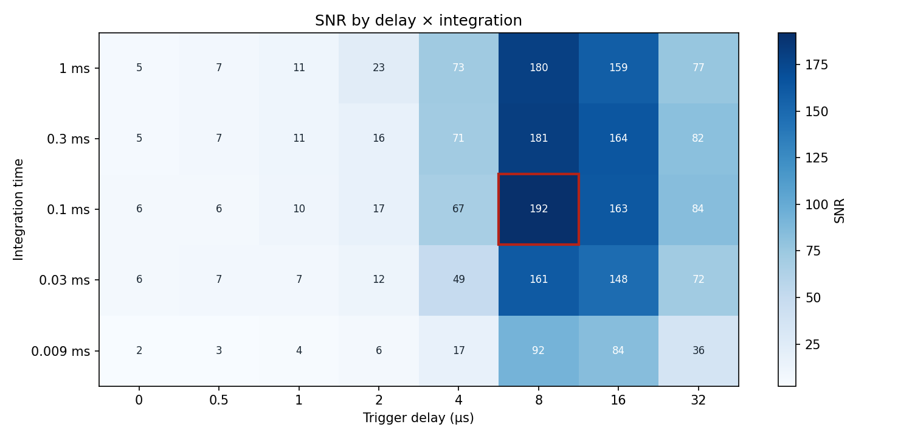

# ProLIBSpector (Public Edition)

[](https://github.com/aleponce4/libs-spectroscopy-workbench/actions/workflows/ci.yml)
[](https://www.gnu.org/licenses/gpl-3.0)
[](https://www.python.org)

Scientific instrument-control and Laser-Induced Breakdown Spectroscopy (LIBS) analysis software featuring simulated acquisition, automated multi-plate workflow orchestration, spectral preprocessing, elemental line identification, and 2D mapping visualization.

---

## Public-Edition Scope

> This repository contains the public edition of ProLIBSpector, a scientific instrument-control and LIBS analysis application. It includes selected generic components for simulated acquisition, spectrum processing, visualization, metadata recording, and nonconfidential analysis workflows. Commercial, customer-specific, proprietary classification, production automation, and private hardware functionality are maintained separately.

---

## Relationship to Private Product

`ProLIBSpector` remains the complete private product and authoritative development codebase. This public repository demonstrates generic scientific-software architecture, software hardware simulation, signal processing algorithms, visualization, testing, and software reliability without exposing commercially sensitive startup algorithms or vendor SDK binaries.

---

## Supported Features

- **Hardware-Free Simulation**: `SimulatedSpectrometer` engine mimicking dark counts, integration timing responses, synthetic emission lines, shot noise, and trigger delays.
- **Automated Multi-Plate Acquisition**: Automated stage control interface supporting 2x2 multi-plate holders (P1–P4, Corning 96-well format), live spectrum canvas, and well status maps.
- **Spectral Preprocessing**: Savitzky-Golay filtering, Asymmetric Least Squares (ALS) baseline correction, Area normalization, Maximum normalization, and Standard Normal Variate (SNV) transformation.
- **Elemental Line Identification**: NIST element line database integration (`element_database.csv`), persistent emission line overlays, and peak matching tolerances.
- **Interactive Visualization**: High-DPI PyQtGraph interactive spectrum canvas, region-of-interest (ROI) selection, peak annotation, and dark spectrum subtraction.
- **Asynchronous File Export**: Lock-free background exporter thread saving acquired spectra and JSON reproducibility manifests with SHA256 data checksums.
- **2D Mapping Analysis**: Spatial grid spectrum visualization, ground-truth benchmark separation, and peak intensity heatmap rendering.

---

## Visual Demonstration & Evidence

### 1. Main Application Interface (Analysis Mode)


*_Main application interface in Analysis Mode displaying an imported reference Titanium spectrum (200–880 nm) with interactive curve controls, spectrum parameter sidebar, and plot navigation tools._*

---

### 2. Automated Acquisition Interface (2x2 Multi-Plate Holder Mode)


*_Automated acquisition interface running a 2x2 multi-plate holder workflow (Plates P01–P04, Corning 96-well format). Displays live spectrum acquisition canvas (Shot #27), active plate progress map (Plate 1/4, 9/96 wells completed, next target A10), and step-by-step wizard sidebar._*

---

### 3. Interactive Periodic Table Element Selector


*_Interactive Periodic Table dialog interface enabling element selection, database selection, and ionization state filtering (I, II, III) for NIST line overlay matching._*

---

### 4. Peak Identification & NIST Database Search


*_Automated peak detection and NIST elemental line matching for Ti I and Ti II emission lines (e.g. 335 nm, 454 nm, 501 nm) with configurable intensity threshold sliders and round-off error tolerances._*

---

### 5. Ground-Truth 2D LIBS Spatial Mapping (Decorated Ceramic Tile)


*_Ground-truth 2D LIBS elemental mapping composite of a decorated ceramic tile sample. Panels display the original sample photograph, co-localized blue pigment elements (Copper Cu vs. Cobalt Co), overglaze dark outline ink (Manganese Mn vs. Lead Pb), and the non-present negative control (Cesium Cs). Colorbar indicates signal-to-noise ratio ($0\text{--}10\sigma$)._*

---

### 6. Single-Point Annotated LIBS Emission Spectrum


*_Annotated net-intensity spectrum from a ceramic tile sample point across 200–1000 nm, identifying key neutral and ionic emission lines for Cu I (325/327 nm), Co I (358/361 nm), Pb I (368/406 nm), Ca II (393/397 nm), Na I (589 nm), and K I (766/769 nm)._*

---

### 7. Timing & Signal-to-Noise Optimization Matrix


*_Signal-to-Noise Ratio (SNR) parameter matrix generated across trigger delays (0–32 µs) and integration windows (0.009–1 ms), identifying an optimal acquisition window at 8 µs delay and 0.1 ms integration (SNR 192)._*

---

## Architecture Overview


```mermaid
flowchart TD
    UI[GUI Layer / PyQt5 & PyQtGraph] --> Launcher[Mode Launcher]
    Launcher --> Analysis[Analysis App]
    Launcher --> Acquisition[Acquisition App]
    
    Acquisition --> Worker[Acquisition Worker Thread]
    Worker --> DevBase[Spectrometer Base Interface]
    DevBase --> SimDev[SimulatedSpectrometer Backend]
    
    Worker --> Writer[Asynchronous Save Exporter]
    Writer --> Storage[(Disk Exporter: CSV & JSON Manifest)]
    
    Analysis --> Preproc[Preprocessing Module: ALS Baseline / SG Filter]
    Analysis --> NIST[NIST Line Database Search]
```

---

## Quick Start (Simulated Mode)

### Prerequisites

Python 3.10+ is required.

### Installation

```bash
git clone https://github.com/aponcefl/libs-spectroscopy-workbench.git
cd libs-spectroscopy-workbench
pip install -e .
```

### Running the Application

Launch the desktop interface using the simulated backend:

```bash
python main.py
```

Select **Simulated Acquisition** to test live spectral collection without physical hardware, or **Analysis Mode** to process offline spectra and compare NIST elemental lines.

---

## Testing & Validation Scope

Automated unit and integration tests verify device initialization, wavelength generation, baseline correction algorithms, multi-threaded export queues, and reproducibility manifest formatting.

To execute the test suite locally:

```bash
pytest
```

The test profile uses synthetic fixtures and simulated hardware drivers. Execution on physical spectrometers and commercial hardware drivers is validated separately on hardware test benches.

---

## Hardware Simulation

The primary execution engine in this public edition is `SimulatedSpectrometer`. It generates synthetic plasma emission spectra based on physical decay models:

$$\text{Intensity}(\lambda, t) = I_{\text{lines}}(\lambda) e^{-t / \tau_{\text{lines}}} + I_{\text{continuum}}(\lambda) e^{-t / \tau_{\text{continuum}}} + \text{Noise}$$

This allows full workflow execution, GUI testing, and data stream validation without requiring a physical spectrometer or pulse laser.

---

## Known Limitations

- **Physical Drivers Omitted**: Physical USB drivers (Ocean Optics SeaBreeze), YiXist C++ DLL wrappers, and GRBL 1.1 laser motion control are omitted from the public edition.
- **Classification Models Omitted**: Proprietary seed classification and delay sweep analysis modules are maintained in the private product repository.

---

## License

This public edition is released under the [GNU General Public License v3.0](LICENSE).
