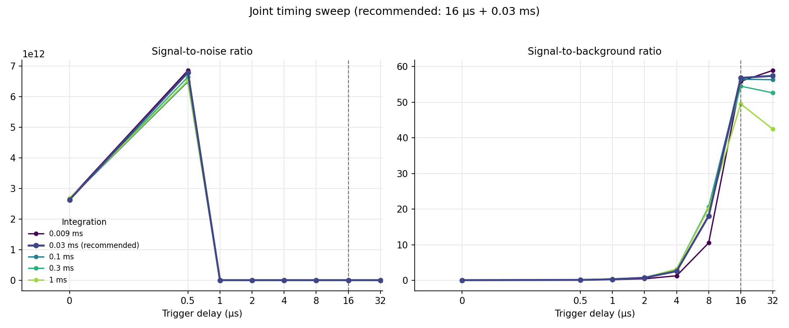
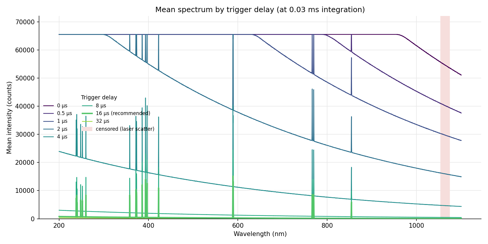

# Timing Sweeps (automatic best delay + integration determination)

> **Confirmed best settings (measured 2026-07-26, YSM-8111-06-01 on the
> blue-coated Al plate; cross-energy comparison of same-day runs):**
>
> | Purpose | Laser energy | Delay | Integration | Measured |
> | --- | --- | --- | --- | --- |
> | **Production default** | **700 mJ** (3-pulse train, holds 10 Hz) | 0 µs | 0.08 ms | 77 persistent lines, info 265 ± 13, peak 43.7k counts (no saturation), line RSD 22 % |
> | Clean single-pulse reference | 200 mJ (1 deterministic pulse) | 0 µs | 0.1 ms | 57 lines, info 193 ± 7, line RSD 20 % |
>
> Never 300 or 500 mJ (pulse count only 80 % reproducible). The plasma has
> a long afterglow: line emission keeps arriving well past 30 µs at every
> energy, so short windows discard real signal — windows of 0.08–0.3 ms
> are the productive range, and the detector noise floor is flat there.
> Reproduce the comparison with `tools/energy_comparison_report.py`.

The YSM-8111-06-01 has an integrated (programmable) trigger-to-exposure
delay. Because the application controls both that delay and the integration
time, the best acquisition window can be found empirically: capture a blank
at a grid of (delay, integration) settings, measure the key facts per
setting, and pick the cell that maximizes line signal-to-noise without
saturation.

Delay and integration are optimized **jointly**, not sequentially: on an
ungated detector the two define one exposure window (`delay` → window start,
`integration` → window length). Integrating past plasma death only adds dark
counts, and the 9-µs minimum integration already truncates line emission at
short delays, so the optimum lives on a 2D surface.

> **Hardware status (updated 2026-07-12):** vendor SDK **1.2.7** is now
> vendored in the repository and exports the integrated delay:
> `SPSetTriggerDelay(DevID, enable, delay_ns)` — 10 ns resolution, 100 ns
> minimum, UINT32 nanoseconds (≈4.29 s max). Our sweep framework carries
> delays in µs, which maps cleanly (µs × 1000 → ns; a 0 µs sweep point maps
> to `enable=FALSE`). The adapter, broker, and metadata wiring **landed
> 2026-07-13** (see
> [ysm8111_sdk127_integration_plan.md](ysm8111_sdk127_integration_plan.md)):
> a delay sweep now drives the real SDK end to end through the brokered
> YiXist client, per-shot applied delays are persisted, and a leftover
> sweep delay is disabled when a run restores normal trigger mode. What
> remains is hardware validation on the physical unit — delay range,
> persistence, and `enable=FALSE` semantics are unverified until then
> (runbook §10 question 8).

## Draft schedules

All values are drafts until the replacement SDK documents the real delay
range and granularity.

| Schedule | Values | Used by |
| --- | --- | --- |
| Delay, 1D screen (µs) | 0, 0.25, 0.5, 1, 2, 4, 8, 16, 32, 64, 128, 256 | 12 plate columns / 12 grid columns |
| Delay, joint grid (µs) | 0, 0.5, 1, 2, 4, 8, 16, 32 | 8 grid columns (mapping joint sweep) |
| Integration, mapping row bands (ms) | 0.009, 0.03, 0.1, 0.3, 1.0 | 5 row bands (mapping joint sweep) |
| Integration, per plate (ms) | 0.009, 0.04, 0.2, 1.0 | 4 plates (plate joint sweep) |

The 0.009 ms point is the published YSM-8111 minimum integration; the tail
values sit well past plasma death so the dark-noise penalty of
over-integrating is measurable.

## The sweep modes

### 2D mapping on a blank metal plate (preferred)

Selected from the mapping panel's **"Timing sweep"** selector:

- **Delay by column** — the 1D screen: each grid column uses the next delay
  from the 12-value schedule. Prefills a square 12 × 12 grid
  (12 replicates per delay; 5.5 × 5.5 mm at 0.5 mm step, 11 × 11 mm at
  1 mm).
- **Delay + integration grid** — the joint screen: delay by **column block**
  (8 values × 3 columns each), integration by contiguous **row band**
  (5 values × 4 rows each); the 3 × 4 spots of a block × band cell are its
  replicates. Tiling replicates in both directions keeps the footprint
  near-square so a small blank fits: 24 × 20 points = 11.5 × 9.5 mm at
  0.5 mm step, 23 × 19 mm at 1 mm (12 replicates per cell, 480 fresh
  spots). Changing **Step (mm)** keeps the 24 × 20 matrix fixed and
  automatically resizes the X/Y footprint, so a larger step directly makes
  the figure larger with more space between spots.

- **Single-pulse confirmation (200 mJ)** — interleaved paired-settings
  preset (added 2026-07-24): the four settings shortlisted by the merged
  sweeps — 0 µs + 0.03 / 0.1 / 0.3 ms and 0.5 µs + 9 µs — assigned
  point-by-point on Latin diagonals over a fixed 12 × 10 grid
  (`pair = (column + row) mod N`), 30 replicates each. Unlike block/band
  assignment, no setting occupies contiguous ground, so a position or
  focus gradient inflates every setting's spread equally instead of
  biasing one of them. Set the laser to **200 mJ** (single deterministic
  pulse; see
  [laser_pulse_temporal_structure.md](laser_pulse_temporal_structure.md)).
  The preset records `laser_energy_mj` in the plan and manifest.
- **Pulse-train ladder (700 mJ)** — the same interleaved machinery used
  as a measurement of the 3-pulse train: 15 µs windows placed on each
  pulse (delays 0 / 20 / 45 µs — opening ~4 µs before the estimated
  arrivals because timing CV is 7 % at this energy; refine from the
  saved oscilloscope waveforms) isolate each pulse's plasma without
  saturation, and 80 µs windows at the same delays capture the train
  minus its first k pulses (per-pulse contributions by subtraction,
  robust to jitter). 6 pairs × 20 replicates on the 12 × 10 grid. Set
  the laser to **700 mJ** — 100 % pulse-count reproducibility while
  keeping the 10 Hz repetition rate that 1000 mJ cannot sustain; never
  run this at 300 or 500 mJ, where the pulse count itself is only 80 %
  reproducible.

Every shot lands on a fresh spot (keep shots/spot at 1), so replication is
never confounded with crater evolution. Choose a step large enough that
neighboring craters do not overlap; the step is now the single spacing and
footprint control. A defocused ~2 mm spot at 1 mm step (observed 2026-07-13,
loose focusing mirror) half-overlaps every neighbor and drops fluence ~16×
versus a 0.5 mm spot — refocusing beats enlarging the grid whenever possible.
Validation errors when the grid has more columns than delays or when the rows
don't divide evenly into integration bands, and warns when trailing delays
would go unmeasured.

### Guarding against confounders (added 2026-07-13)

- **Laser scatter (Nd:YAG 1064 nm).** The fundamental sits inside the
  YSM-8111 range (192.6–1104.9 nm), so elastic scatter would be scored as
  "the strongest line" in every cell, and if it saturates, the saturation
  gate would disqualify every cell. The analysis censors **1054–1074 nm**
  from all metrics by default (`DEFAULT_EXCLUDED_WAVELENGTH_BANDS_NM`);
  in-band saturation is still reported separately as
  `excluded_saturation_fraction`, the metrics carry `peak_wavelength_nm` as
  a sanity check, and the spectra plots shade the censored band. Override
  with `--exclude-nm LO:HI` / `--keep-laser-band` on
  `tools/delay_sweep_report.py`.
- **Position/alignment gradients.** Delay is assigned by column block and
  integration by row band, so a smooth spatial gradient (mirror-path
  alignment drift, plate tilt, focus change) would masquerade as a timing
  effect if the schedules were ascending across the grid. The GUI prefill
  therefore applies `decorrelated_schedule()` — the sorted values woven
  low, high, second-lowest, second-highest, … — making value vs. position
  essentially uncorrelated (rank r ≈ 0.2 instead of 1.0) while staying
  deterministic. The analysis groups shots by the **recorded per-shot
  values**, so schedule order never changes the metrics; it only breaks the
  confound. Within a cell, replicates already spread over a 3-column ×
  4-row patch, and position-driven spread inflates `snr_se`, which widens
  the recommendation tie band rather than producing false confidence.
- **Multi-pulse laser emission (added 2026-07-24).** Oscilloscope
  characterization
  ([laser_pulse_temporal_structure.md](laser_pulse_temporal_structure.md))
  shows the Q-switch laser emits a **train** of ~100 ns pulses per
  trigger: exactly 1 at 200 mJ, up to 5 at 1000 mJ, spaced ~19–55 µs,
  with per-pulse peak intensity invariant to pump energy. Sweeps at
  200 mJ are clean single-pulse data; at higher energies an integration
  window spanning the pulse separation accumulates several plasmas, so
  energy and window length must be interpreted together. Avoid 300 and
  500 mJ (pulse count only 80 % reproducible).
- **Confirmation on fresh surface.** A 50 × 85 mm blank fits 4+ complete
  joint-sweep footprints at 0.5 mm step (11.5 × 9.5 mm each). Repeat the
  sweep on a fresh region (shift the origin) — the weave order makes any
  surviving position effect show up as disagreement between the two
  reports' recommendations rather than as a consistent bias.

### 96-well plates, four at a time (pared-down joint sweep)

Preset **"96-well 4-plate delay+integration sweep"**
(`ysm8111_relay_96x4_delay_integration_sweep`): delay by well column
(12 values), integration by **plate** (4 values), and the 8 wells of each
column are that cell's replicates. One shot per well by default — raise
shots/well when the wells can afford repeat craters and more replicates are
wanted per cell. The single-parameter **"96-well trigger-delay sweep"**
preset remains for delay-only runs on one plate.

Validation refuses a run that sweeps integration both by column and by
plate, errors when more plates are planned than the schedule covers, and
warns when schedule values would go unmeasured.

### Laser energy is required metadata (added 2026-07-26)

The pump energy is dialed by hand on the laser (no software control) but
decides the pulse count per trigger, so every acquisition — mapping and
96-well plate alike — must declare it: a required **Laser energy (mJ)**
dropdown (200–1000 mJ in 100 mJ steps — the characterized range) blocks
the plan until selected, and the value is stored as `laser_energy_mj` in
the plan, manifest, and run metadata. The two energy presets pre-select
their characterized energy; the dropdown remains the source of truth.

### What both modes store (identically)

- Per shot: `trigger_delay_us` and `integration_time_us` — in each plate's
  `_plate_state.json` history (plate mode) or `_mapping_grid_index.csv` and
  the timing-samples CSV (mapping mode).
- Per run: the full schedules (`column_delays_us`,
  `plate_integration_times_ms` / `row_integration_times_ms`) in the plan,
  manifest, summary, and `run_metadata.txt`.
- A spectrometer without a programmable delay aborts the run at the first
  target instead of silently recording delays that were never applied.
  Redundant hardware calls (same setting as the previous target) are
  skipped.

## Replicates: how many and why

Two requirements set the count:

- **Noise-floor estimation**: the shot-to-shot standard deviation has
  relative error ≈ 1/√(2(n−1)) — ±35 % at n=5, ±24 % at n=10, ±14 % at
  n=25. Below ~8 shots the SNR estimate itself is too unstable to rank
  settings.
- **Ranking adjacent settings**: with a typical 10 % shot RSD, n=10 gives a
  ~3 % standard error on the mean — enough to resolve the ~2× spacing of a
  log-spaced screen. A confirmation pass around the winner should use 25–30.

Defaults follow this: 12 replicates per cell (3 columns × 4 rows) in the
mapping joint sweep, 8 wells per column in the plate version. For a Phase-2
confirmation, re-run the mapping sweep with a finer schedule centered on the
winner and larger blocks/bands.

## Analysis: key facts and recommendation

`prolibspector/analysis/delay_sweep.py` loads either run type
(`load_delay_sweep(run_directory)` auto-detects) and computes one row per
(delay, integration) cell:

| Metric | Meaning |
| --- | --- |
| `continuum_level` | Median rolling-percentile baseline: how much plasma continuum is left |
| `line_signal` | Net area above the baseline (pixels > 3× noise) |
| `noise_level` | Per-shot **detection** noise floor: median per-pixel shot-to-shot std over quiet *active* pixels (nonzero in ≥ half the shots). Zero-clamped pixels carry no noise information — their variance is clamped away too — so they are excluded, and heavily clamped cells floor at one ADC count. Plasma shot-to-shot variation is deliberately *not* in this number; it lives in the SE and RSD columns. |
| `snr` / `snr_se` | Strongest net line height / noise floor, with its replicate standard error |
| `peak_wavelength_nm` | Where that strongest line sits (sanity check against scatter/artifacts) |
| `sbr` / `median_line_sbr` | Strongest-line and median persistent-line height / local continuum (NaN when the zero-clamped baseline is 0 there) |
| `line_count` / `line_count_all` | Resolved peaks (≥ 5× noise on the cell mean) that also appear at ≥ 3× noise in **at least half the individual shots**, vs. every mean-spectrum peak. A single-shot spike smeared into the mean is not a line. |
| `information_score` (± SE) | Σ log1p(SNR) over the *persistent* peaks — full-inventory information, with diminishing returns per line |
| `saturation_fraction` | Fraction of non-censored pixels at 98 %+ of full scale |
| `excluded_saturation_fraction` | Saturation inside the censored laser band (informational) |

All metrics ignore the censored Nd:YAG scatter band (1054–1074 nm by
default) — see "Guarding against confounders" above.

**Three recommendations, not one** (`build_recommendation_suite`) — "best"
depends on what the preset is for, so the report shows three picks and
flags when they disagree:

- **Most information-rich** (headline, `recommend_trigger_delay`): drop
  dead/saturated cells; rank by `information_score`; every cell within the
  tolerance band of the best (the larger of the best cell's replicate SE
  and 5 % of the best score) is a candidate and the **shortest
  integration** wins (throughput, least dark accumulation), then the
  higher score, then the shortest delay.
- **Most repeatable** (`recommend_repeatable`): evaluates the strongest
  confidently identified sample lines individually (auto-derived from the
  line inventory — air lines, tentative "?" matches, and lines missing from
  more than 10 % of shots even at their best cell are excluded; override
  with `--target-lines`). Cells keeping every target line are ranked by
  the median per-line shot-to-shot RSD — plasma repeatability on lines an
  operator actually watches. RSDs within ×1.25 of the best are statistical
  ties (a std estimate has ~1/√(2(n−1)) relative error); shortest
  integration breaks them.
- **Best compromise** (`recommend_compromise`): each cell's score averaged
  with its measured neighbors along both timing axes, so a broad stable
  plateau beats one unusually lucky cell; 5 % band, shortest integration.

The per-cell behaviour of the target lines (height, SNR, local SBR, shot
RSD, presence fraction) is written to `delay_sweep_target_lines.csv` and
shown for the shortlisted settings in the report. When several runs are
merged, the report also lists each run's individual winner — per-run
disagreement is the signature of a position/drift confound that pooling
would otherwise hide.

### One-command report

```
python tools/delay_sweep_report.py <run_directory>
```

auto-detects the run type and writes `delay_sweep_report/` inside the run:
a **single self-contained `delay_sweep_report.html`** (recommended setting
with reasons, the per-setting stats table with SNR ± SE and the recommended
row highlighted, and all figures embedded — heatmap, key-facts curves, the
mean-spectrum overlay, and a raw-data panel showing **every replicate shot**
around the strongest line for the shortest / recommended / longest delay),
plus the standalone `delay_sweep_metrics.csv`,
`delay_sweep_recommendation.json`, and PNGs.

The HTML grid explorer labels strong resolved lines in the selected cell
with solid peak-anchored leader lines. Labels use collision-checked lanes
instead of fixed rows, and lines below 1% of that cell's displayed maximum
are omitted to keep the spectrum readable. Its cell detail shows SNR,
resolved-line count, and information score together; the grid color and
cell number remain SNR while the recommendation uses information score.

## Example (simulated YSM-8111-06-01, joint grid on a metal blank)

Regenerate with `python tools/delay_sweep_example.py` (8 delays × 5
integrations × 10 shots).


The surface shows both effects at once: moving right (longer delay) kills
the continuum and then the lines; moving up (longer integration) first
recovers the line emission the 9-µs window truncates, then slowly loses SNR
to dark noise. The optimum is the interior cell around 8 µs delay with a
0.03–0.3 ms window.





In this draw the 0.03, 0.1, 0.3 and 1 ms windows at 8 µs were statistically
indistinguishable (within one standard error), so the rule picked the
fastest: **8 µs delay + 0.03 ms integration**. That tie-break is the point
of recording `snr_se` — with 10 replicates per cell, "the best cell" is
often a statistical tie, and the shortest window is then strictly better.
The real optimum on the physical unit will differ; run the mapping joint
sweep on a metal blank once the replacement SDK is integrated and let the
recommendation pick it from measured data.

## Known gaps / next steps

- **Background per integration setting**: dark + ambient scale with the
  window length, so the single mapping background reference is only right
  for one integration value. A joint sweep should capture one laser-off
  background set per integration value; not implemented yet.
- **Drift reference**: a repeated fixed-setting column at the start and end
  of the grid would separate instrument drift from the timing axes; today
  the many replicate rows only average drift out.
- Phase-2 confirmation (finer schedule, 25–30 replicates) is a manual
  re-run with edited schedules for now.
